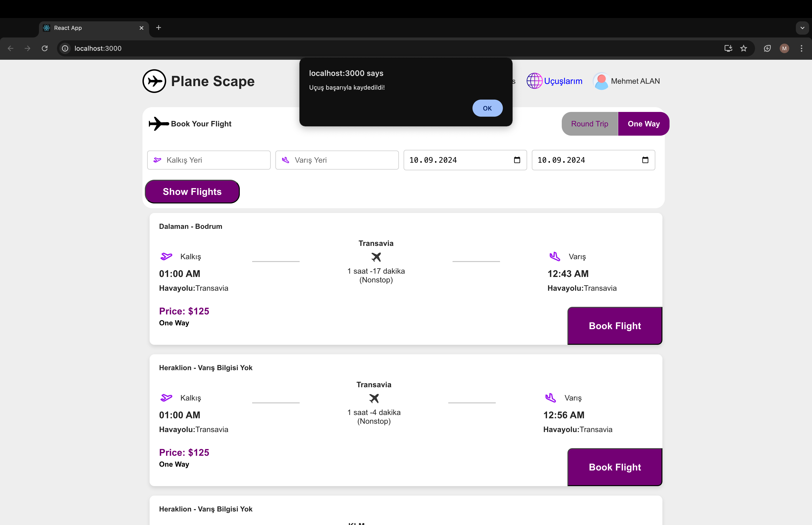

# Airplane Booking App

Bu proje, uçuş rezervasyonları yapmanıza olanak tanıyan bir web uygulamasıdır. Hem ön yüz (React) hem de arka yüz (Node.js ve MongoDB) bileşenlerinden oluşur. Ancak kullanmış olduğum API'de arrival(varış noktası) bilgisi bulunmuyor. Bu yüzden bir çok uçuş için varış noktası için "varış bilgisi yok" yazmaktadır. Sayfanın en aşağısında uygulama görselleri mevcuttur. İki adet mobil uygulama görselleri de var.

## Gereksinimler

- Node.js (14 veya daha üstü) -> https://nodejs.org/en

## Kurulum

### 1. Proje Klonlama

Projeyi klonlamak için aşağıdaki komutu kullanın:

git clone https://github.com/mehmtalnn07/flights.git

### 2. Kütüphane Yüklemeleri

1.**npm install**
   ```bash
     npm install
   ```


2.**npm install express**
```bash
     npm install express
```
Express, Node.js üzerinde web uygulamaları geliştirmek için kullanılan minimal ve esnek bir web framework'üdür. HTTP isteklerini yönetmek ve yönlendirmek için kullanılır.

3.**npm install mongoose**
```bash
   npm install mongoose
```
Mongoose, MongoDB veritabanı ile etkileşim kurmak için kullanılan bir ODM (Object Data Modeling) kütüphanesidir. Veritabanı modellerinizi oluşturmanıza ve MongoDB ile etkileşimde bulunmanıza yardımcı olur.

4.**npm install body-parser**
```bash
     npm install body-parser
```
Body-parser, gelen isteklerin gövdesini çözümlemek için kullanılır. JSON formatındaki verileri almak için gereklidir.

5.**npm install cors**
```bash
     npm install cors
```
CORS (Cross-Origin Resource Sharing), farklı alanlardan gelen isteklerin kontrol edilmesine olanak tanır. Frontend ve backend arasındaki iletişimi sağlamak için bu middleware kullanılır.

6.**npm install react react-dom**
```bash
     npm install react react-dom
```
React, kullanıcı arayüzleri geliştirmek için kullanılan bir JavaScript kütüphanesidir. Component tabanlı bir yapıya sahiptir ve uygulamanızın ön yüzünü oluşturur.

7.**npm install axios**
```bash
     npm install axios
```
Axios, HTTP istekleri yapmak için kullanılan bir kütüphanedir. Backend ile iletişim kurarak veri çekmek veya göndermek için kullanılır.

## Projeyi Çalıştırma

Bu projeyi çalıştırmak için aşağıdaki adımları izleyin:

1. **VSCode ile Projeyi Açın**
   - Projeyi Visual Studio Code (VSCode) ile açın.

2. **Terminalden src Klasörüne Gitme**
   - VSCode içindeki terminali açın ve `src` klasörüne gidin:
     ```bash
     cd src
     ```

3. **Sunucuyu Başlatma**
   - Sunucuyu başlatmak için terminalde aşağıdaki komutu çalıştırın:
     ```bash
     node server.js
     ```
   - Terminalde "MongoDB bağlantısı başarılı!" yazısını görmelisiniz. Bu, MongoDB veritabanına başarıyla bağlandığınız anlamına gelir.

4. **Ön Yüzü Başlatma**
   - Yeni bir terminal açın (VSCode'da sağ üst köşeden yeni terminal açabilirsiniz) ve aşağıdaki komutu çalıştırın:
     ```bash
     npm start
     ```
   - Artık projenizin çalışıyor olması gerekiyor!





